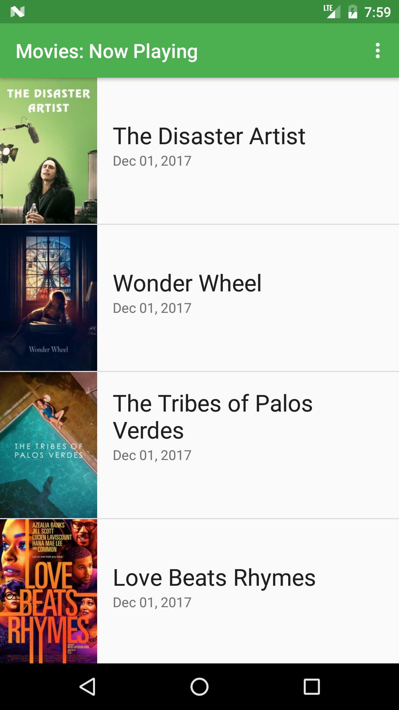
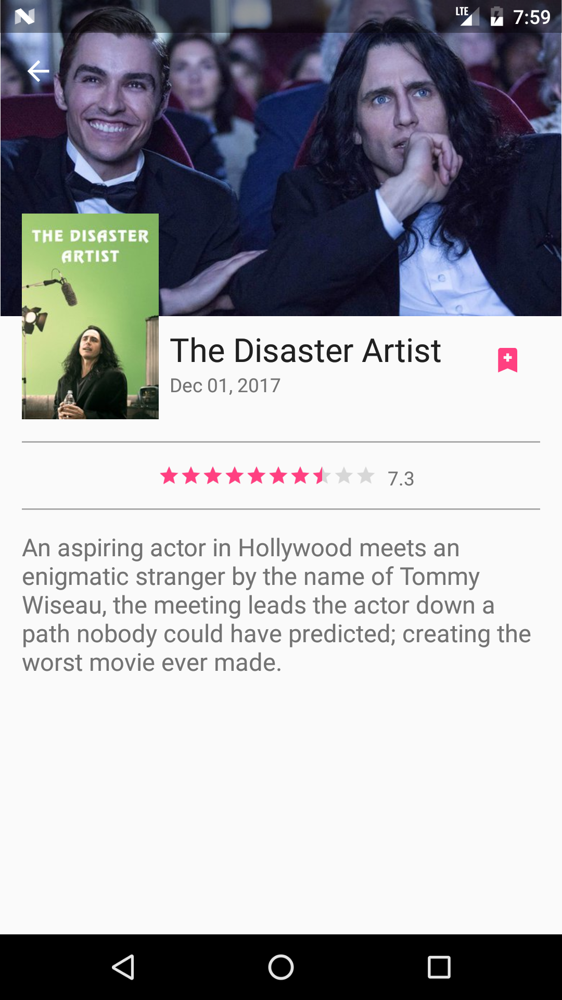
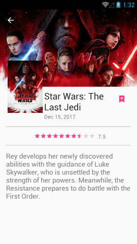
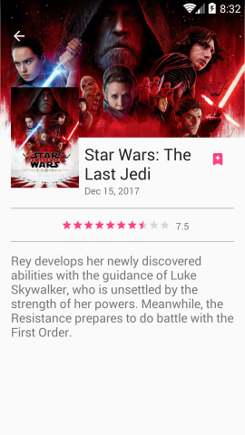
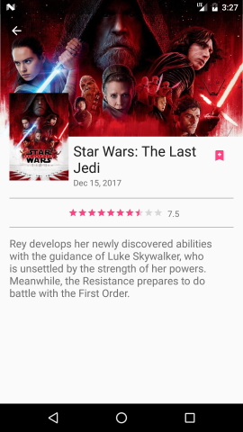
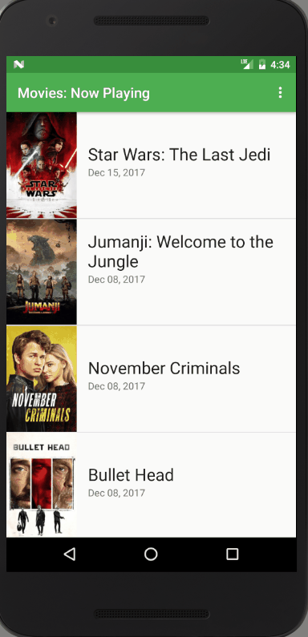

## Movies: Now Playing

This project uses [**TMDb API**](https://www.themoviedb.org/documentation/api) to get movies on theaters.

It displays movies with preferred **content language** and **region**.

Fetched movies are saved to database to avoid unnecessary network calls.

The movies are synced every specified day and user is notified.

### Configuration

In order to run this project, you need to get an **API key** from [**TMDb**](https://www.themoviedb.org/).

You need to set your api key in your `gradle.properties` file as following:

    tmdbApiKey = your-api-key

### Screenshot

Movie List             |  Movie Detail
:-------------------------:|:-------------------------:
  |  

### Status & ActionBar Transparency & Overlay Support

API 16             |  API 19             |  API 24
:-------------------------:|:-------------------------:|:-------------------------:
  |    |  

### Shared Element Transition

### Credits

Google Developer Challenge ScholarShip for Android Track

#Udacity